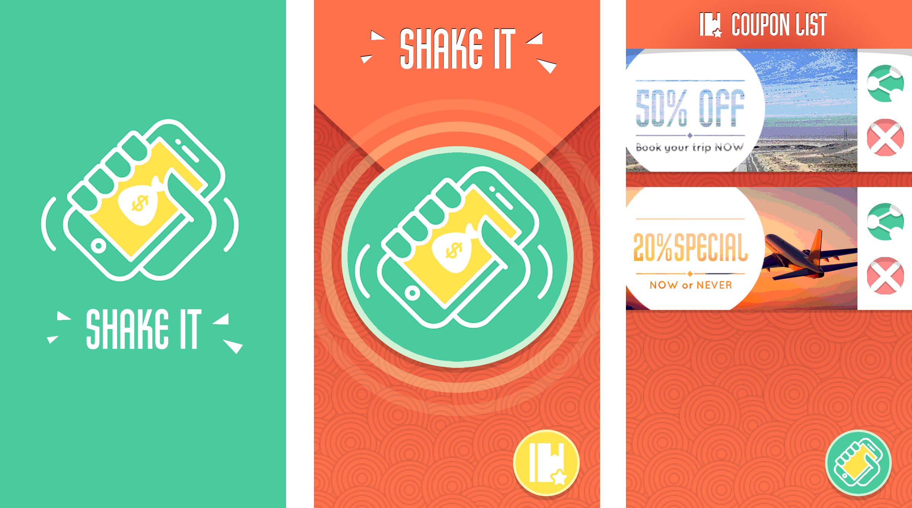
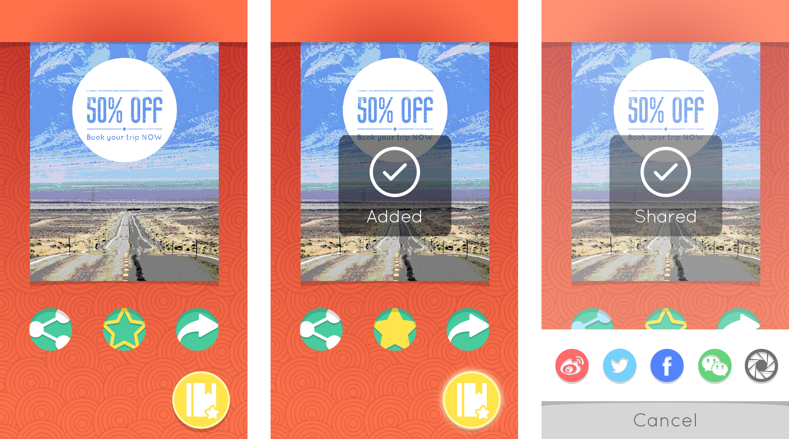

# shakeit

A mobile web application built for my undergrad final project.

* Users could shake their phone and get coupons, which they could then star and share
* Coupon recommendation system learns from user behaviors and becomes smarter 
* Powered by Node.js and MongoDB

